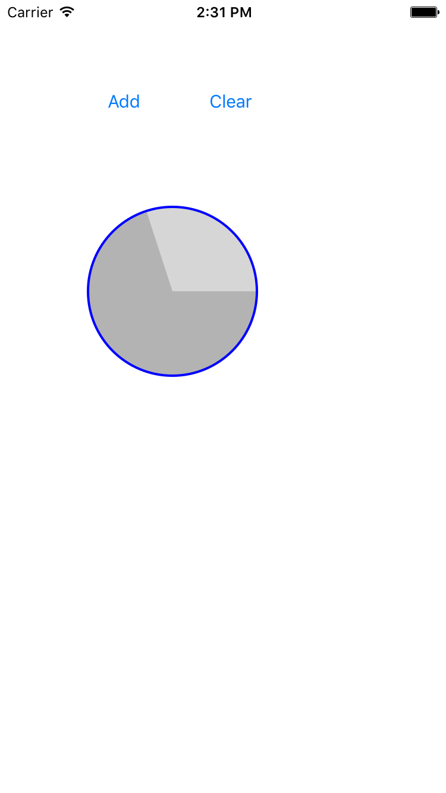

# CircleProgressBar-IOS
Circle progressbar on IOS by swift 2.0 (Swift 2.0 实现的IOS圆形进度条)

# Useage

## CircleProgressBar.swift

### set progress value:
> CircleProgressBar.progress = (0~1)

### set progress Color
> CircleProgressBar.progressColor = UIColor

### set progress background color
> CircleProgressBar.baseColor = UIColor

### set border Width
> CircleProgressBar.borderWidth = CGFloat

### set border color
> CircleProgressBar.borderColor = UIColor

# ScreenShot

